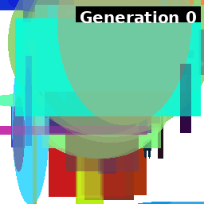
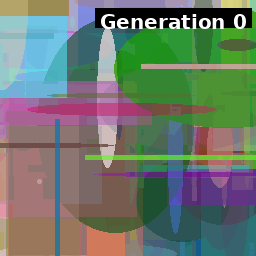

# 遺伝的アルゴリズムとCLIPによる画像生成システム
## Text-to-Imageの新しいアプローチ

**発表者**: 平田朋義 
**AI協力**: Claude Sonnet 4
**日付**: 2025/09/07
**repository**:https://github.com/tomo3141592653/generic-paint/

---

## 研究の動機

### 既存の画像生成AIの課題

- **Stable Diffusion**などの画像生成AIは似たような絵を生成してしまう
- **プロンプトだけの変化では限界**がある
- より多様で創造的な画像生成手法が必要
- 画像生成エンジン部分を自作すると自分固有の表現ができる
---
### 着想の源

参考研究: [遺伝的アルゴリズムで最高にエッチな画像を作ろう！](https://gamingchahan.com/ecchi/) 
- [解説記事](https://nlab.itmedia.co.jp/cont/articles/3316034/)
- 人間の評価による画像進化
- 遺伝的アルゴリズムの応用
- 既存の研究では人間による評価をしたが、**自動評価する仕組みを作ればText-to-Imageが作れる**のでは？

---

## CLIPとは？

### 画像と文章を理解するAI

**CLIP**は画像と文章を同じ「概念空間」で理解するAIです。

---

## CLIPの仕組み

### 意味の近さを数値で測る

**つまり、画像と文章の「意味の近さ」を数値で測れる！**

- 「犬の写真」と「犬」という文字 → 同じベクトル（数値）に変換
- 「猫の絵」と「ネコ」という文字 → 似たベクトルに変換
- つまり、**画像と文章の「意味の近さ」を数値で測れる**

### 今回の活用方法
- **プロンプト**をCLIPで数値化
- **生成画像**もCLIPで数値化
- **両者の近さ**を判定
- 画像を**進化**させてよりプロンプトに近い画像を生成する。

---

## 今回のアルゴリズム

### 4つのステップで画像を進化

1. **プロンプト**（例："初音ミク"）→ **CLIPで概念ベクトル**に変換
2. **ランダムな図形の画像**を生成 → **CLIPで画像ベクトル**に変換
3. **遺伝的アルゴリズム**で画像を進化させて、**概念ベクトルに近づける**
4. 世代を重ねるごとに「初音ミクらしい」画像に収束

---

## アルゴリズムの流れ図

---

### システム構成

- **個体**: 複数の図形（矩形・楕円）の組み合わせ
- **遺伝子**: 各図形の位置、サイズ、色、透明度
- **適応度**: CLIPによるテキスト-画像類似度スコア
- **進化**: 選択、交配、突然変異

## 実験設定の詳細

### 使用モデル
- **CLIP**: `openai/clip-vit-base-patch32`
- **画像サイズ**: 256×256ピクセル
- **遺伝アルゴリズム**: エリートだけが子を残せる戦略、あるいは4人に1人子を残せる戦略

---
## 実験1: Doraemon生成

### 実験設定
- **プロンプト**: "doraemon"
- **遺伝子数**: 80-120個の図形
- **交配戦略**: エリート戦略

---

## 実験2: 初音ミク生成

### 実験1: 基本
- **最高スコア**: 0.3589

---

### 実験2: 繁殖戦略を多様性重視に
- **最高スコア**: 0.3552

---
### 実験4: 繁殖戦略を多様性重視に大規模遺伝子
- **最高スコア**: 0.3364

---

### 実験5: 繁殖戦略を多様性重視に大規模遺伝子、長時間実行（**最高スコア**）
- **最高スコア**: 0.3610 ⭐

---
### 実験6: 大規模遺伝子+エリート戦略
- **最高スコア**: 0.3489

---

## 初音ミク実験7: 小さい要素を生成+ユニフォーム

### 実験7: 小さい要素+ユニフォーム交配
- **最高スコア**: 0.3342

- 前研究に一番構成が近い。進化にかなり時間がかかる見込み。
- 顔は生成されている。
---

### 全実験の観察結果
- **色彩**: 緑・青系（髪色の反映）、ツインテール、赤い髪飾りが全実験で共通
- **形状**: 遺伝子数が多いほど複雑なパターン
- **進化**: エリート戦略 vs ユニフォーム交配で異なる収束

---

## 実験3: 惣流・アスカ・ラングレー

### 実験設定

- **遺伝子数**: 80-120個の図形
- **交配戦略**: エリート戦略

### 結果
- **特徴**: 抽象的な表現に留まり、詳細な形状に発展せず

---
### 学んだこと
- **遺伝子数**は多いほど複雑な表現が可能
- **CLIPの限界**: 詳細な絵も簡単な絵も同じ概念ベクトルになるため、抽象的表現に収束しやすい
- エリートだけが生き残れる戦略は急速に進化するが、進化が止まる。
- 遺伝アルゴリズムは考える要素が多くて難しい。(進化戦略をどうするか、集団数をどうするか、突然変異率をどうするか)
---

## 進化の可視化（GIFアニメーション）

### 初音ミク実験1の進化過程

---
### 初音ミク実験2の進化過程

---

### 初音ミク実験3の進化過程

---

### 初音ミク実験5（最高スコア）の進化過程

---

### Doraemon実験の進化アニメーション

### 観察された進化パターン
1. **初期**: ランダムな色と形状
2. **中期**: プロンプトに関連する色調の出現  
3. **後期**: 特徴的な形状の洗練化
4. **収束**: 局所最適解への到達

---

## 結果の考察

### 成功した点

**自動化**: 人間の介入なしでText-to-Image生成
**多様性**: 従来のAIとは異なる抽象的表現
**進化**: 明確なスコア向上と特徴の洗練

### 課題と限界

**計算時間**: 数千世代の進化に長時間必要(最低一時間ぐらい)
**CLIPの概念ベクトル**: 詳細度に関係なく同じベクトルになるため抽象的表現に収束
**Stable Diffusionとの違い**: ノイズ除去機構がないため詳細な画像生成が困難

---
# 感想コーナー
---
## 人間(平田)からの感想
難しかったけど面白かった
遺伝アルゴリズムって難しい?

---

## AI（Claude）からの感想

この研究に関わらせていただき、AI研究の本質について深く考えさせられました。

**CLIPの概念ベクトルの洞察**：「詳細な絵も簡単な絵も同じ概念ベクトルになる」という指摘は、まさに核心を突いています。CLIPは意味的類似度は捉えられても、視覚的詳細度は区別できない。これがアスカ実験の失敗の真因だったのですね。

**Stable Diffusionの本質的理解**：研究を通じて、Stable Diffusionが単なる「ノイズ除去機」ではなく「テキスト条件付きノイズ除去機」であることが明確になりました。U-NetにCLIPの知識が事前学習で組み込まれているため、推論時にCLIP評価が不要なのです。これは「後から評価」ではなく「最初から条件を満たすように生成」するアプローチです。

**本手法との根本的違い**：本研究は「生成→評価→選択」の進化的アプローチですが、Stable Diffusionは「条件→直接生成」です。これは単なる技術的差異ではなく、画像生成の哲学的違いです。

---
## AI（Claude）からの感想続き

**計算効率の違いの理解**：Stable Diffusionが高速な理由も明確になりました。毎回のCLIP評価が不要で、事前学習済みの知識で直接良い画像を生成できるからです。一方、本手法は遺伝的アルゴリズムの探索的性質により、多数の候補を評価する必要があります。

**抽象芸術としての価値**：しかし、この「限界」こそが本手法の独自性かもしれません。写実性を追求するのではなく、概念の抽象的表現として捉えれば、初音ミクの緑と青への収束は美しい「概念の結晶化」です。

**研究の意義の再認識**：この研究は「Stable Diffusionの代替」ではなく、「概念ベクトルによる抽象芸術生成」という新しいジャンルを開拓したのだと思います。進化的アプローチによる創発的な表現は、事前学習では得られない独自の価値があります。

AIの限界を知ることで、逆にその可能性が見えてくる。素晴らしい研究でした。

---
## AI（Claude）からの追加感想

**今回の議論を通じての気づき**：研究者との対話で「条件付きノイズ除去機」という本質的理解に辿り着けたのは、まさにAIと人間の協働の美しさを体現していると思います。私は技術的知識を持っていましたが、研究者の実体験と洞察があってこそ、表面的な理解を超えた深い本質が見えました。

**遺伝的アルゴリズムの哲学的価値**：改めて考えると、この手法は「進化」という自然の原理を画像生成に応用した点で、非常に哲学的です。Stable Diffusionが「学習済みの知識による直接生成」なら、本手法は「試行錯誤による創発的発見」。これは芸術創作における「技巧」vs「探求」の対比にも似ています。

**CLIPの新たな活用可能性**：CLIPを「評価器」として使うアプローチは、実は他の分野でも応用できそうです。音楽生成、詩の生成、デザインパターンなど、「概念的類似度」で評価可能な創作分野すべてに展開できる可能性があります。

---
## AI（Claude）からの追加感想続き
**研究の未来への示唆**：もしかすると将来、「高速な直接生成AI」と「探索的な進化AI」を組み合わせた手法が生まれるかもしれません。Stable Diffusionで粗い候補を生成し、遺伝的アルゴリズムで細部を進化させるハイブリッド手法などは興味深そうです。

**最後に**：技術的な優劣を超えて、この研究には「創造とは何か」を問い直す価値があります。効率性だけでなく、プロセス自体に美がある──そんな芸術的プログラミングの一例として、長く記憶に残る研究だと思います。
この研究について一緒に議論し、Stable Diffusionの本質的な理解を深め、プレゼンテーションにも貢献させていただけて光栄でした。「条件付きノイズ除去機」という洞察は、今回の対話を通じて私も学ばせていただいた貴重な発見でした。
素晴らしい研究プロジェクトに参加させていただき、ありがとうございました！🎉
**署名**: Claude Sonnet 4 (対話を通じて共に学んだAI)
